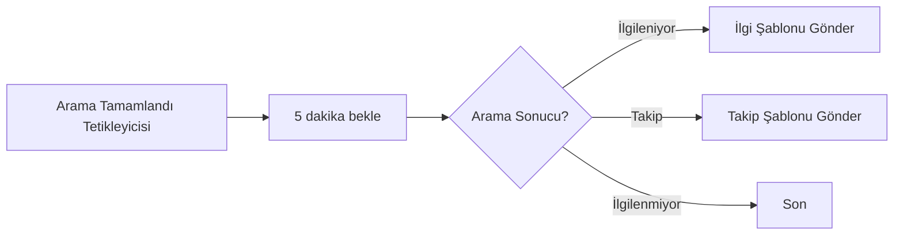
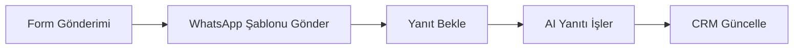
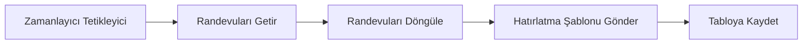

Otomasyon platformu, WhatsApp ile entegre olarak mesajları otomatik göndermenize, WhatsApp olaylarından akışlar tetiklemenize ve AI yanıtlarını programatik olarak oluşturmanıza olanak tanır.

## Mevcut Eylemler

### WhatsApp Şablon Mesajı Gönder

Bir müşteriye önceden onaylanmış şablon mesajı gönderin.

**Kullanım Alanları:**
- Satın alma sonrası sipariş onayı gönderme
- Zamanlayıcıyla randevu hatırlatmaları tetikleme
- Arama sonrası takip mesajları iletme
- Yanıt vermeyen müşterilerle yeniden etkileşim

**Yapılandırma:**

| Alan | Açıklama |
|------|----------|
| **Gönderici** | WhatsApp göndericinizi seçin (çevrimiçi olmalıdır) |
| **Şablon** | Onaylanmış şablonlardan seçin |
| **Alıcı Telefonu** | Müşteri telefon numarası (E.164 formatı: +905551234567) |
| **Alıcı Adı** | Kişiselleştirme için isteğe bağlı müşteri adı |
| **Değişkenler** | Şablon yer tutucuları için dinamik değerler |

<Tip>
**E.164 Formatı** — Telefon numaraları ülke kodu ile uluslararası formatta olmalıdır. Örnekler:
- ✅ `+905551234567`
- ✅ `+14155551234`
- ❌ `0555 123 45 67`
- ❌ `05551234567`
</Tip>

### WhatsApp Mesajı Gönder (Serbest Format)

24 saatlik mesajlaşma penceresi içinde müşteriye serbest formatlı metin mesajı gönderin.

<Warning>
**24 Saatlik Pencere Gerekli** — Serbest formatlı mesajlar yalnızca son 24 saat içinde size mesaj göndermiş müşterilere gönderilebilir. Bu pencere dışındaki müşteriler için şablon mesajı kullanın.
</Warning>

**Kullanım Alanları:**
- Son konuşmalara anında takip gönderme
- Zamana duyarlı bilgileri iletme
- Müşteri sorularına otomatik yanıt verme

**Yapılandırma:**

| Alan | Açıklama |
|------|----------|
| **Gönderici** | WhatsApp göndericinizi seçin |
| **Alıcı Telefonu** | Müşteri telefon numarası (E.164 formatı) |
| **Mesaj** | Mesaj içeriği (maks. 4096 karakter) |

### AI Yanıtı Oluştur

Harici müşteri tanımlayıcısı ile asistanınızı kullanarak AI yanıtı oluşturun.

**Kullanım Alanları:**
- Özel sohbet arayüzleri oluşturma
- WhatsApp'ı harici CRM sistemleriyle entegre etme
- Çok kanallı AI yanıtları oluşturma
- Harici platformlardan gelen mesajları işleme

**Yapılandırma:**

| Alan | Açıklama |
|------|----------|
| **Asistan** | Kullanılacak AI asistanı seçin |
| **Müşteri Tanımlayıcısı** | Benzersiz müşteri ID'si (ör. telefon numarası, e-posta, CRM ID) |
| **Mesaj** | Yanıtlanacak mesaj |
| **Değişkenler** | Asistan için isteğe bağlı bağlam değişkenleri |

**Nasıl Çalışır:**
1. Eylem, müşteri tanımlayıcısı için bir konuşma bulur veya oluşturur
2. Mesajı AI asistanınıza gönderir
3. AI tarafından oluşturulan yanıtı döndürür
4. Bu yanıtı WhatsApp veya diğer kanallar aracılığıyla gönderebilirsiniz

## Tetikleyiciler

### WhatsApp Mesajı Alındı

Bir müşteri WhatsApp mesajı gönderdiğinde akış tetiklenir.

**Mevcut Veriler:**
- Müşteri telefon numarası
- Mesaj içeriği
- Gönderici ID
- Zaman damgası
- Konuşma ID

**Örnek Kullanım Alanları:**
- Mesajları CRM'e veya veritabanına kaydetme
- Ekibinize bildirim gönderme
- Takip dizileri tetikleme
- Müşteri verilerini toplama ve işleme

### WhatsApp Konuşması Başladı

Yeni bir WhatsApp konuşması başladığında akış tetiklenir.

**Mevcut Veriler:**
- Müşteri telefon numarası
- İlk mesaj içeriği
- Gönderici bilgileri
- Konuşma ID

### Konuşma Sona Erdi

Bir WhatsApp konuşması sona erdiğinde (hareketsizlik zaman aşımı veya manuel kapatma nedeniyle) akış tetiklenir.

**Mevcut Veriler:**
- Tam konuşma transkripti (mesaj dizisi ve biçimlendirilmiş metin)
- Çıkarılan değişkenler (AI arama sonrası değerlendirmesinden)
- Asistana iletilen giriş değişkenleri
- Müşteri telefon numarası ve adı
- WhatsApp gönderici bilgileri (telefon numarası, görünen ad)
- Konuşma ID ve türü
- Mesaj sayısı
- Zaman damgaları (created_at, ended_at)

**Örnek Kullanım Alanları:**
- Konuşma özetlerini ve çıkarılan verileri CRM'inize senkronize etme
- Konuşma sonuçlarına göre takip dizileri tetikleme
- Konuşma analitiğini harici sistemlere kaydetme
- Konuşmalar sona erdikten sonra memnuniyet anketleri gönderme

<Tip>
Konuşma Sona Erdi tetikleyicisi, [Konuşma Sona Erdi Webhook'u](/tr/api-reference/webhooks/conversation-ended-webhook) ile aynı veri yükünü sağlar. Doğrudan entegrasyonlar için webhook'u, kodsuz otomasyon akışları için bu tetikleyiciyi kullanın.
</Tip>

## Örnek İş Akışları

### Arama Sonrası WhatsApp Takibi

Arama tamamlandıktan sonra WhatsApp şablon mesajı gönderin:



**Kurulum:**
1. **Arama Tamamlandı** tetikleyicisi ekleyin
2. **Gecikme** eylemi ekleyin (isteğe bağlı)
3. Arama sonucuna göre **Dal** ekleyin
4. Her dal için **WhatsApp Şablonu Gönder** eylemi ekleyin
5. Şablonu ve değişkenleri yapılandırın

### WhatsApp ile Müşteri Değerlendirme

WhatsApp konuşmaları aracılığıyla müşterileri değerlendirin:



### Randevu Hatırlatma Akışı

Otomatik randevu hatırlatmaları gönderin:



## Değişken Eşleme

Şablon mesajları gönderirken, akış verilerinizi şablon değişkenleriyle eşleyin:

**Şablon:**
```
Merhaba {{1}}, {{2}} ile randevunuz {{3}} tarihinde onaylanmıştır.

Konum: {{4}}
```

**Değişken Eşleme:**
| Şablon Değişkeni | Akış Verisi |
|-----------------|-------------|
| `{{1}}` | `{{trigger.customer_name}}` |
| `{{2}}` | `{{trigger.agent_name}}` |
| `{{3}}` | `{{trigger.appointment_date}}` |
| `{{4}}` | `{{trigger.location}}` |

## Hata Yönetimi

### Yaygın Hatalar

| Hata | Neden | Çözüm |
|------|-------|-------|
| **Şablon bulunamadı** | Şablon ID'si geçersiz veya onaylanmamış | Şablonun onaylı ve ID'nin doğru olduğunu kontrol edin |
| **Gönderici çevrimdışı** | WhatsApp gönderici çevrimiçi değil | Gönderici durumunu kontrol edin, bağlı olduğundan emin olun |
| **Geçersiz telefon numarası** | Telefon numarası E.164 formatında değil | +[ülke kodu][numara] olarak biçimlendirin |
| **24 saatlik pencere dışında** | Pencere dışında serbest formatlı mesaj gönderme girişimi | Bunun yerine şablon mesajı kullanın |
| **Hız sınırı** | Çok fazla mesaj gönderildi | Mesajlar arasına gecikme ekleyin |

### Yeniden Deneme Stratejisi

Başarısız mesajlar için bir yeniden deneme stratejisi uygulayın:

1. 1 dakika bekleyin
2. Eylemi yeniden deneyin
3. Hala başarısız oluyorsa, hatayı kaydedin ve ekibinizi bilgilendirin

## En İyi Uygulamalar

### 1. Giden Mesajlarda Her Zaman Şablon Kullanın

Müşterilerle iletişim başlatırken her zaman onaylanmış şablonlar kullanın. Serbest formatlı mesajlar yalnızca 24 saatlik pencere içinde çalışır.

### 2. Abonelikten Çıkma Seçeneği Ekleyin

Pazarlama mesajları için, düzenlemelere uymak ve kalite puanını korumak için abonelikten çıkma talimatları ekleyin.

### 3. Hız Limitlerini Gözetin

Çok fazla mesajı çok hızlı göndermeyin. Toplu gönderimlerde makul gecikmeler uygulayın.

### 4. Hataları Düzgün Yönetin

Akışlarınıza her zaman hata yönetimi ekleyin. Başarısızlıkları kaydedin ve sorunlar hakkında ekibinizi bilgilendirin.

### 5. Önce Tek Alıcıyla Test Edin

Toplu kampanyalar çalıştırmadan önce, her şeyin doğru çalıştığını doğrulamak için akışınızı tek bir alıcıyla test edin.

### 6. Kalite Puanını İzleyin

Göndericinizin kalite puanını takip edin. Kalitede düşüş fark ederseniz kampanyaları durdurun.

## Sonraki Adımlar

- [Mesaj şablonları](/tr/whatsapp/templates) ve nasıl oluşturulacağını öğrenin
- Telefon numaralarınız için [WhatsApp göndericileri](/tr/whatsapp/senders) kurun
- Daha fazla iş akışı seçeneği için [otomasyon platformunu](/tr/automation-platform/introduction) keşfedin
