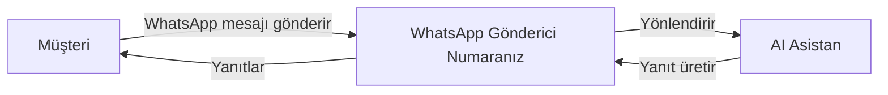

<Note>
**Yeni: Harici Numaralar** — Artık kendi cep numaranızı WhatsApp'a getirebilirsiniz! Platform numaralarını kullanın veya mevcut cep numaranızı SMS/sesli doğrulama ile bağlayın.
</Note>

## WhatsApp Business Entegrasyonu Nedir?

WhatsApp Business entegrasyonu, AI asistanlarınızı WhatsApp'a bağlamanızı sağlayarak dünyanın en popüler mesajlaşma platformu üzerinden müşterilerle otomatik metin tabanlı konuşmalar yapmanıza olanak tanır.

Bu entegrasyon ile:

- **Müşteri mesajlarını alın** ve AI ile otomatik yanıt verin
- **Şablon mesajları gönderin** konuşma başlatmak veya müşterileri yeniden hedeflemek için
- **AI destekli yanıtlar kullanın** 7/24 müşteri desteği için
- **Otomasyon akışlarını tetikleyin** WhatsApp konuşmalarına dayalı olarak
- **Tüm konuşmaları takip edin** kontrol panelinizde

## Nasıl Çalışır

1. **WhatsApp Gönderici oluşturun** platform numarası veya kendi harici numaranızı kullanarak
2. **AI Asistan bağlayın** gelen mesajları otomatik olarak işlemek için
3. **Mesaj Şablonları oluşturun** giden konuşmalar için (Meta tarafından zorunlu)
4. **Müşteriler size mesaj gönderir** ve anında AI destekli yanıtlar alır

## Temel Bileşenler

<CardGroup cols={2}>
  <Card title="WhatsApp Göndericiler" icon="phone" href="/tr/whatsapp/senders">
    WhatsApp Business mesajlaşması için kayıtlı telefon numaraları
  </Card>
  <Card title="Mesaj Şablonları" icon="file-lines" href="/tr/whatsapp/templates">
    İşletme tarafından başlatılan konuşmalar için önceden onaylanmış mesaj formatları
  </Card>
  <Card title="AI Konuşmaları" icon="robot" href="/tr/whatsapp/conversations">
    Müşteri mesajlarına AI destekli otomatik yanıtlar
  </Card>
  <Card title="Otomasyon" icon="bolt" href="/tr/whatsapp/automation">
    Otomasyon platformu aracılığıyla akışları tetikleyin ve mesaj gönderin
  </Card>
</CardGroup>

## WhatsApp Business Kurallarını Anlama

WhatsApp'ın anlamanız gereken belirli iş mesajlaşma kuralları vardır:

### 24 Saatlik Mesajlaşma Penceresi

<Info>
Bir müşteri size mesaj gönderdiğinde, serbest formatta mesaj gönderebileceğiniz **24 saatlik bir pencere** açılır. Bu pencere kapandıktan sonra müşteriyle yeniden iletişim kurmak için **onaylanmış bir şablon** kullanmanız gerekir.
</Info>

- **24 saat içinde**: Herhangi bir mesajı doğrudan gönderin
- **24 saat sonra**: Önceden onaylanmış şablon mesajı kullanmalısınız

### Şablon Mesajları

Şablon mesajları şunlar için gereken önceden onaylanmış mesaj formatlarıdır:

- Müşterilerle yeni konuşmalar başlatma
- 24 saatlik pencere sonrası müşterileri yeniden hedefleme
- Bildirim, güncelleme veya pazarlama mesajları gönderme

Şablonlar kullanılmadan önce Meta'ya onay için gönderilmelidir (genellikle dakikalardan 24 saate kadar sürer).

### Kalite Puanı ve Limitler

Meta mesajlaşma kalitenizi izler. Yeni göndericiler sınırlı mesajlaşma kapasitesiyle başlar ve iyi kaliteyi korudukça artar:

| Kalite Seviyesi | Günlük Mesaj Limiti |
|-----------------|---------------------|
| Yeni Gönderici  | ~250 mesaj          |
| Düşük Kalite    | 1.000 mesaj         |
| Orta            | 10.000 mesaj        |
| Yüksek Kalite   | 100.000+ mesaj      |

<Warning>
Yüksek engelleme oranları veya spam raporları kalite puanınızı düşürür ve mesajlaşma limitlerinizi azaltır. Her zaman ilgili, talep edilen içerik gönderin.
</Warning>

## Desteklenen Özellikler

### Desteklenenler

- **Platform numaraları** — Platformumuz üzerinden satın alınan numaraları otomatik AI doğrulamasıyla kullanın
- **Harici numaralar** — Kendi cep numaranızı getirin ve SMS veya sesli arama ile doğrulayın
- AI destekli otomatik yanıtlar
- Şablon mesajları (Hizmet, Pazarlama, Kimlik Doğrulama)
- Sesli Arama Talebi şablonları (WhatsApp üzerinden arama izni isteme)
- Konuşma geçmişi ve takibi
- Otomasyon platformu entegrasyonu

### Medya ve Görüntü

- **Görüntü analizi (Vision)** — Müşteriler görüntü gönderdiğinde, AI asistanınız bunları görüntü destekli LLM'ler (OpenAI, Claude, Gemini) kullanarak analiz edebilir.
- **Sesli mesaj transkripsiyonu** — Gelen sesli notlar asistanınızın dil ayarlarına göre otomatik olarak yazıya dökülür.
- **Medya ekleri** — Tüm gelen medya (görüntüler, ses, video, belgeler) ek olarak saklanır ve kontrol panelinizden erişilebilir.

### Yakında

- WhatsApp sesli aramalar

## Başlarken

<Steps>
  <Step title="Numara Türünüzü Seçin">
    **Platform numarası** (bizden satın alınan) veya kendi **harici cep numaranızı** kullanıp kullanmayacağınıza karar verin. Harici numaralar doğrulama için SMS veya sesli arama alabilmelidir.
  </Step>
  <Step title="WhatsApp Gönderici Oluşturun">
    **WhatsApp Göndericiler** bölümüne gidin ve numaranızı WhatsApp Business'a bağlamak için kurulum sihirbazını takip edin.
  </Step>
  <Step title="AI Asistan Bağlayın">
    Gelen mesajlara otomatik yanıt vermek için bir AI asistanı bağlayın.
  </Step>
  <Step title="Şablonlar Oluşturun">
    Giden konuşmalar için mesaj şablonları oluşturun ve Meta onayını bekleyin.
  </Step>
  <Step title="Mesajlaşmaya Başlayın">
    WhatsApp gönderiniz hazır! Müşteriler size mesaj gönderebilir ve AI destekli yanıtlar alabilir.
  </Step>
</Steps>

## Sonraki Adımlar

- [WhatsApp gönderici oluşturmayı](/tr/whatsapp/senders) öğrenin
- [Mesaj şablonlarını](/tr/whatsapp/templates) ve onay sürecini anlayın
- WhatsApp için [otomasyon tetikleyicileri](/tr/whatsapp/automation) kurun
