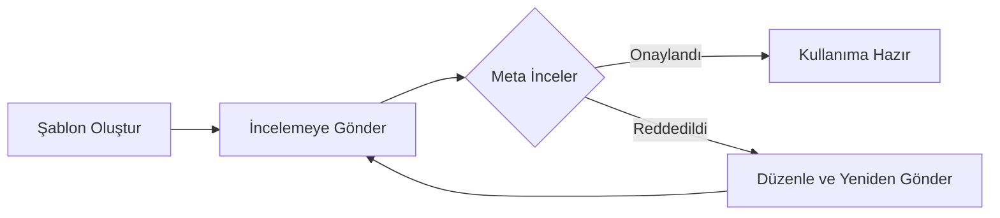

Mesaj şablonları, WhatsApp'ta işletme tarafından başlatılan konuşmalar için Meta tarafından onaylanması gereken önceden tanımlanmış mesaj formatlarıdır. Müşterilere giden mesaj göndermeden önce onaylanmış şablonlarınız olmalıdır.

## Mesaj Şablonları Nedir?

Mesaj şablonları, yapılandırılmış mesajlardır ve şu özelliklere sahiptir:

- Kullanılmadan önce Meta'ya onay için gönderilmeleri gerekir
- Müşterilerle konuşma başlatmanıza olanak tanır
- Kişiselleştirme için değişkenler içerebilir
- 24 saatlik pencere dışında mesajlaşma için zorunludur

<Info>
**Neden Şablonlar?** — WhatsApp, spam'ı önlemek ve işletmelerin müşterilere değerli, alakalı mesajlar göndermesini sağlamak için şablonları zorunlu tutar. İşletme tarafından başlatılan tüm mesajlar onaylanmış şablonları kullanmalıdır.
</Info>

## Şablonlara Ne Zaman İhtiyacınız Var?

| Senaryo | Şablon Gerekli mi? |
|---------|-------------------|
| Müşteri size önce mesaj gönderirse | Hayır — 24 saat içinde serbest formatlı yanıt verilebilir |
| 24 saat içinde yanıt verme | Hayır — herhangi bir mesaj gönderilebilir |
| Yeni bir konuşma başlatma | **Evet** |
| 24 saat sonra tekrar etkileşim | **Evet** |
| Bildirim/güncelleme gönderme | **Evet** |
| Pazarlama mesajları | **Evet** |

## Şablon Kategorileri

Şablonlar, onay gereksinimlerini ve kullanım durumlarını belirleyen kategorilere ayrılmıştır:

### Hizmet Şablonları

İşlemsel ve hizmetle ilgili mesajlar.

**Kullanım alanları:**
- Sipariş onayları
- Kargo güncellemeleri
- Randevu hatırlatmaları
- Hesap bildirimleri
- Ödeme makbuzları

**Onay:** Genellikle dakikalar içinde onaylanır

### Pazarlama Şablonları

Tanıtım ve satışla ilgili mesajlar.

**Kullanım alanları:**
- Promosyon teklifleri
- Ürün duyuruları
- Bültenler
- Satış kampanyaları
- Yeniden etkileşim mesajları

**Onay:** Daha uzun sürebilir, daha sıkı inceleme

<Warning>
**Kategoriler Arası İçerik Yok** — Hizmet şablonlarına tanıtım içeriği eklemeyin. Meta, kategori ve içerik uyuşmazlığı olan şablonları reddedecektir.
</Warning>

### Kimlik Doğrulama Şablonları

Doğrulama ve güvenlik mesajları.

**Kullanım alanları:**
- Tek kullanımlık şifreler (OTP)
- Doğrulama kodları
- Giriş onayları
- Güvenlik uyarıları

**Onay:** Standart inceleme

### Sesli Arama İsteği Şablonları

WhatsApp sesli aramaları için izin istemek amacıyla kullanılan özel şablonlar.

**Kullanım alanları:**
- WhatsApp sesli arama yoluyla müşterileri aramak için izin isteme
- Sesli arama isteği butonu içermelidir

**Onay:** Otomatik (standart format kullanıldığında)

## Şablon Oluşturma

### Adım 1: Şablonlara Gidin

1. **WhatsApp Göndericiler** → Göndericinizi seçin → **Şablonlar** sekmesine gidin
2. Veya doğrudan **WhatsApp Şablonları** bölümüne gidin
3. **Şablon Oluştur** butonuna tıklayın

### Adım 2: Temel Ayarları Yapılandırın

| Alan | Açıklama |
|------|----------|
| **Ad** | Benzersiz tanımlayıcı (küçük harf, yalnızca alt çizgi). Örnek: `siparis_onay_v1` |
| **Kategori** | Hizmet, Pazarlama, Kimlik Doğrulama veya Sesli Arama İsteği seçin |
| **Dil** | Şablon dili (içerikle eşleşmelidir) |

<Tip>
**Adlandırma En İyi Uygulamaları:**
- Açıklayıcı adlar kullanın: `randevu_hatirlatma`, `siparis_kargolandi`
- Sürüm numarası ekleyin: `hosgeldin_mesaji_v2`
- Genel adlardan kaçının: ~~`sablon1`~~, ~~`test`~~
</Tip>

### Adım 3: Şablon İçeriğini Yazın

Şablonlar birden fazla bileşen içerebilir:

#### Başlık (İsteğe Bağlı)
- **Metin Başlığı**: Kısa başlık (en fazla 60 karakter)
- **Medya Başlığı**: Görsel, video veya belge (yakında)

#### Gövde (Zorunlu)
Ana mesaj içeriği. Mesajınızı buraya yazarsınız.

**Değişken Kullanımı:**
Dinamik içerik için `{{1}}`, `{{2}}` vb. kullanın:

```
Merhaba {{1}}, {{2}} numaralı siparişiniz kargoya verildi!

Tahmini teslimat: {{3}}
Kargonuzu takip edin: {{4}}
```

<Info>
**Örnek Değerler** — Şablon oluştururken her değişken için örnek değerler sağlamalısınız. Bunlar Meta'nın şablonunuzun amacını anlamasına yardımcı olur ve onay için gereklidir.
</Info>

#### Alt Bilgi (İsteğe Bağlı)
Altta kısa bir satır (en fazla 60 karakter). Genellikle abonelikten çıkma bilgisi veya yasal uyarılar için kullanılır.

#### Butonlar (İsteğe Bağlı)
Şablonunuza etkileşimli butonlar ekleyin:

- **Hızlı Yanıt**: Önceden tanımlanmış yanıt butonları (ör. "Evet", "Hayır", "Daha Fazla Bilgi")
- **Harekete Geçirici**: Web sitesine veya telefon numarasına bağlantı
- **Sesli Arama İsteği**: Sesli arama izni istemek için buton

### Adım 4: Onaya Gönderin

1. Şablon içeriğinizi gözden geçirin
2. **Onaya Gönder** butonuna tıklayın
3. Şablon durumu "Onay Bekliyor" olarak değişir
4. Meta incelemesini bekleyin (dakikalar ile 24 saat arası)

## Şablon Onay Süreci



### Onay Süreleri

| Kategori | Tipik Süre |
|----------|-----------|
| Hizmet | Dakikalar ile birkaç saat |
| Pazarlama | Saatler ile 24 saat |
| Kimlik Doğrulama | Dakikalar ile birkaç saat |
| Sesli Arama İsteği | Genellikle anında |

### Şablon Durumları

| Durum | Açıklama |
|-------|----------|
| <span style={{color: '#6b7280'}}>**Taslak**</span> | Henüz gönderilmedi |
| <span style={{color: '#f59e0b'}}>**Beklemede**</span> | Gönderildi, Meta incelemesi bekleniyor |
| <span style={{color: '#22c55e'}}>**Onaylandı**</span> | Kullanıma hazır |
| <span style={{color: '#ef4444'}}>**Reddedildi**</span> | İnceleme başarısız, ret nedenine bakın |
| <span style={{color: '#6b7280'}}>**Devre Dışı**</span> | Düşük kalite nedeniyle Meta tarafından devre dışı bırakıldı |

## Yaygın Ret Nedenleri

Onay oranınızı artırmak için bu yaygın hatalardan kaçının:

### ❌ Hizmet Şablonlarında Tanıtım İçeriği

**Sorun:** Hizmet şablonlarına indirim, teklif veya pazarlama dili eklemek.

**Çözüm:** Tanıtım içeriği için Pazarlama kategorisini kullanın.

### ❌ Eksik veya Belirsiz Değişken Örnekleri

**Sorun:** Açık örnek değerleri olmayan `{{1}}` gibi değişkenler.

**Çözüm:** Değişkenin amacını gösteren gerçekçi örnek değerler sağlayın:
- ✅ `{{1}}` = "Ahmet Yılmaz"
- ✅ `{{2}}` = "#12345"
- ❌ `{{1}}` = "test"

### ❌ Agresif veya Tehditkâr Dil

**Sorun:** Taciz, tehdit veya spam olarak algılanabilecek içerik.

**Çözüm:** Profesyonel, samimi bir dil kullanın. Müşteriye sağlanan değere odaklanın.

### ❌ URL Kısaltıcılar

**Sorun:** bit.ly, tinyurl veya diğer URL kısaltıcıları kullanmak.

**Çözüm:** Kendi alan adınızdan tam, markalı URL'ler kullanın.

### ❌ Yanlış Kategori Seçimi

**Sorun:** İçerik türünüz için yanlış kategori seçmek.

**Çözüm:** Kategoriyi içerik amacıyla kesinlikle eşleştirin.

### ❌ Kısıtlı İçerik

**Sorun:** Alkol, kumar, yetişkin içeriği, siyasi mesajlar veya yasadışı faaliyetlerle ilgili şablonlar.

**Çözüm:** Bunlara izin verilmez. Meta'nın ticaret politikalarını inceleyin.

## Şablonları Kullanma

### Şablon Mesajları Gönderme

Onaylandıktan sonra şablon mesajları gönderebilirsiniz:

1. **Otomasyon Platformu ile**: "WhatsApp Şablonu Gönder" eylemini kullanın
2. **API ile**: Şablon ID'si ve değişkenlerle gönderme endpoint'ini çağırın

### Değişken Değiştirme

Gönderirken değişkenleri gerçek değerlerle değiştirin:

**Şablon:**
```
Merhaba {{1}}, randevunuz {{2}} tarihinde saat {{3}}'da onaylanmıştır.
```

**Gönderilen Mesaj:**
```
Merhaba Ahmet, randevunuz 15 Ocak tarihinde saat 14:00'da onaylanmıştır.
```

## En İyi Uygulamalar

### 1. Açıklayıcı Adlar Kullanın

```
✅ siparis_onay_v1
✅ randevu_hatirlatma
✅ kargo_takip_guncelleme
❌ sablon1
❌ test
❌ mesaj
```

### 2. Mesajları Kısa Tutun

WhatsApp kullanıcıları hızlı, net mesajlar bekler. Konuya gelin ve net bir harekete geçirici mesaj ekleyin.

### 3. Etkileşimli Butonlar Kullanın

Müşterilerin yanıt vermesini kolaylaştırmak için Hızlı Yanıt veya Harekete Geçirici butonlar ekleyin:

- "Siparişi Takip Et"
- "Destek İle İletişime Geç"
- "Ayrıntıları Görüntüle"
- "Randevuyu Onayla"

### 4. Toplu Gönderimden Önce Test Edin

Şablonunuzu büyük bir kitleye göndermeden önce her zaman tek bir alıcıyla test edin. Bu, biçimlendirme sorunlarını yakalamanıza yardımcı olur.

### 5. Şablonları Erkenden Oluşturun

Onay 24 saate kadar sürebilir. Şablonlarınızı ihtiyacınız olmadan önce oluşturup gönderin.

### 6. Yedek Şablonlar Hazırlayın

Önemli şablonların birden fazla versiyonunu oluşturun. Biri reddedilir veya devre dışı bırakılırsa, hazır alternatifleriniz olur.

## Şablonları Düzenleme

<Warning>
**Sınırlı Düzenleme** — Bir şablon onaylandıktan sonra düzenlenemez. Değişiklik yapmak için farklı bir adla yeni bir şablon oluşturmanız gerekir.
</Warning>

**Düzenlenebilir:**
- Taslak şablonlar (henüz gönderilmemiş)
- Reddedilen şablonlar (sorunları düzeltin ve yeniden gönderin)

**Düzenlenemez:**
- Onaylanmış şablonlar
- Beklemedeki şablonlar (incelemeyi beklemeleri gerekir)

## Şablon Limitleri

Meta, şablon oluşturmada limitler uygular:

- WhatsApp Business Hesabı başına maksimum şablon sayısı: Hesap seviyesine göre değişir
- Şablon adları gönderici başına benzersiz olmalıdır
- Reddedilen şablonlar da limitinize dahil edilir

## Sonraki Adımlar

- Şablonları otomatik göndermek için [otomasyon tetikleyicileri](/tr/whatsapp/automation) kurun
- [WhatsApp göndericileri](/tr/whatsapp/senders) ve gönderici yönetimi hakkında bilgi edinin
- Konuşma yanıtları için [AI asistan yapılandırmasını](/tr/ai-assistants/what-is-ai-assistant) inceleyin
